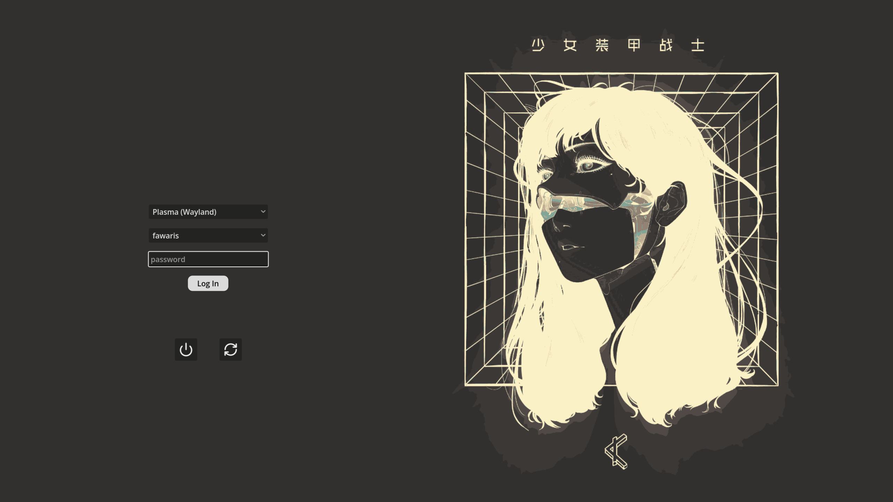

# GodotGreetd

A GDExtension for the [Greetd](https://man.sr.ht/~kennylevinsen/greetd/) IPC Protocol.

Create **greeters** (login applications) using the [Godot game engine](https://godotengine.org/).

**Is this a good idea?** I don't know, but it's fun :)

## Getting Started

This extension implements the greetd IPC protocol as GDScript-friendly classes. See `demo/login_screen.gd` for a working example.

- **[Creating your greeter](docs/GREETER.md)** — how to build a greeter using this extension, test it, and deploy it.
- **[Building the extension](docs/DEVELOPMENT.md)** — how to set up the C++ development environment and compile the GDExtension.
- **[Protocol reference](docs/greetd-protocol.md)** — in-depth explanation of the greetd IPC protocol, state machine, and flow diagrams.
