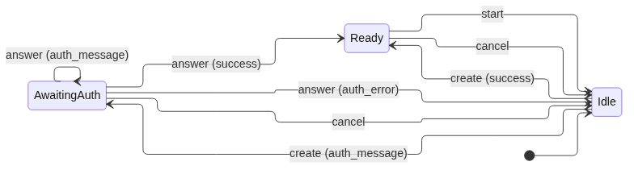
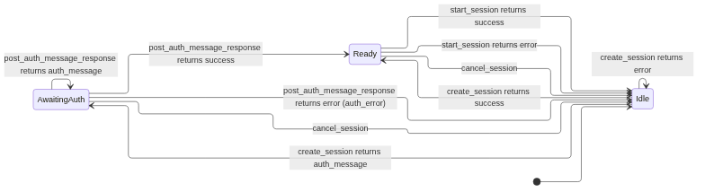
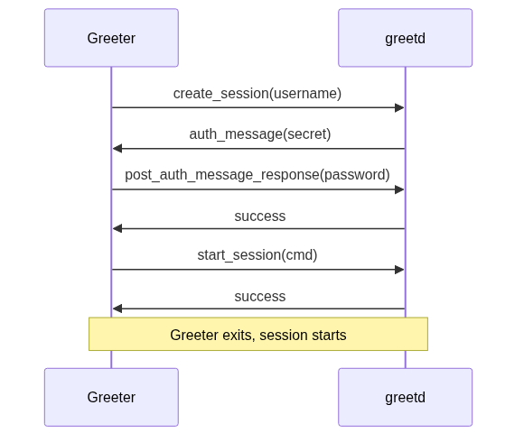
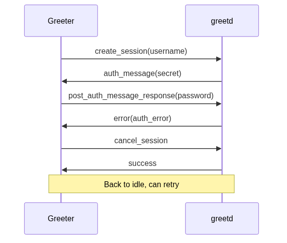

# greetd IPC Protocol

Reference documentation for the greetd IPC protocol, based on `man greetd-ipc` and the [greetd source code](https://git.sr.ht/~kennylevinsen/greetd).

## Connection Model

Communication happens over a UNIX socket. The path is provided via the `GREETD_SOCK` environment variable.

The greetd server supports two connection patterns:

- **One connection per request** (gtkgreet style): Connect, send one request, read the response, close. This is the simpler approach and what gtkgreet (the reference greeter) uses.
- **Persistent connection**: Keep a single connection open and send all requests over it. The server loops reading requests until EOF.

Both should work and the performance difference should be negligible. This extension uses the one-connection-per-request approach.

## Message Format

```
<payload-length><payload>
```

- `payload-length`: 32-bit integer in native byte order
- `payload`: UTF-8 encoded JSON string

## Requests

| Type                         | Fields                                  | Purpose                                          |
|------------------------------|-----------------------------------------|--------------------------------------------------|
| `create_session`             | `username` (string)                     | Create a session and initiate login for a user   |
| `post_auth_message_response` | `response` (string or null)             | Answer or acknowledge an authentication message  |
| `start_session`              | `cmd` (string[]), `env` (string[])      | Start the configured session                     |
| `cancel_session`             | *(none)*                                | Cancel the session being configured              |

## Responses

| Type           | Fields                                              | Purpose                                              |
|----------------|-----------------------------------------------------|------------------------------------------------------|
| `success`      | *(none)*                                            | Request succeeded                                    |
| `error`        | `error_type` (enum), `description` (string)         | Request failed                                       |
| `auth_message` | `auth_message_type` (enum), `auth_message` (string) | Auth message requiring an answer or acknowledgement  |

### Auth Message Types

| Type      | Meaning                                                       |
|-----------|---------------------------------------------------------------|
| `visible` | User input should be visible (e.g. username)                  |
| `secret`  | User input should be hidden (e.g. password)                   |
| `info`    | Informational; acknowledge with a null response               |
| `error`   | Non-terminal error message; acknowledge with a null response  |

### Error Types

| Type         | Meaning                                                    |
|--------------|------------------------------------------------------------|
| `auth_error` | Authentication failed (e.g. wrong password). Not fatal.    |
| `error`      | General error. See description for details.                |

## State Machine

The protocol follows a strict state machine. Sending a request that is invalid for the current state returns an error.

See [state-machine.mmd](diagrams/state-machine.mmd) and [state-machine-full.mmd](diagrams/state-machine-full.mmd) for diagram sources.

#### Simplified



#### Complete



### States

| State            | Valid requests                                    | Description                           |
|------------------|---------------------------------------------------|---------------------------------------|
| **Idle**         | `create_session`, `cancel_session` (no-op)        | No session being configured           |
| **AwaitingAuth** | `post_auth_message_response`, `cancel_session`    | Session has pending auth questions    |
| **Ready**        | `start_session`, `cancel_session`                 | Auth complete, session ready to start |

### All Transitions

| From         | Request                      | Response       | Next State   |
|--------------|------------------------------|----------------|--------------|
| Idle         | `create_session`             | `auth_message` | AwaitingAuth |
| Idle         | `create_session`             | `success`      | Ready        |
| Idle         | `create_session`             | `error`        | Idle         |
| Idle         | `cancel_session`             | `success`      | Idle         |
| AwaitingAuth | `post_auth_message_response` | `auth_message` | AwaitingAuth |
| AwaitingAuth | `post_auth_message_response` | `success`      | Ready        |
| AwaitingAuth | `post_auth_message_response` | `error`        | Idle         |
| AwaitingAuth | `cancel_session`             | `success`      | Idle         |
| Ready        | `start_session`              | `success`      | Idle         |
| Ready        | `start_session`              | `error`        | Idle         |
| Ready        | `cancel_session`             | `success`      | Idle         |

### Behaviors

- `cancel_session` is valid in any state. If no session exists, it's a no-op that returns success.
- `create_session` may return multiple `auth_message` responses in sequence (PAM can ask several questions). There is no limit on the number of auth messages.
- After an `auth_error`, the session is invalidated automatically. Start a new attempt with `create_session`; an additional `cancel_session` request is not required.
- For question auth messages (`visible`, `secret`), pass a string to `answer_auth_message()`. An empty string is a valid answer and is sent as `""`.
- For informational auth messages (`info`, `error` types), call `answer_auth_message(null)`. This acknowledges the message with a JSON `null` response so greetd can continue the authentication conversation.
- After `answer_auth_message(null)`, greetd can return any of the following:
		- `auth_message`: Authentication is still in progress. Handle the new message according to its type and answer or acknowledge it. The next message can be `visible`, `secret`, `info`, or `error`; greetd does not guarantee a particular order or number of messages.
		- `success`: Authentication is complete and the session is ready for `start_session()`.
		- `error`: Authentication or session setup failed. An `auth_error` normally means the submitted credentials were rejected; a general `error` describes another failure.

	## Typical Flows

### Successful Login

See [flow-successful-login.mmd](diagrams/flow-successful-login.mmd) for diagram source.



### Failed Password

See [flow-failed-password.mmd](diagrams/flow-failed-password.mmd) for diagram source.


